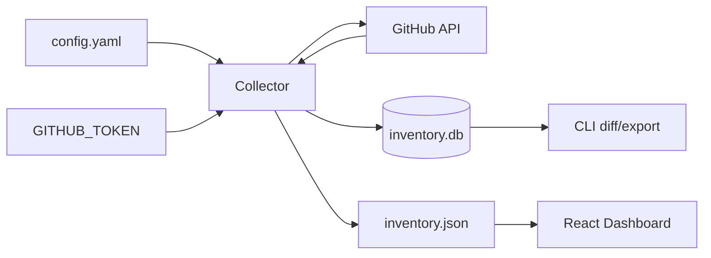

# Architecture

## Overview

GitHub Repo Inventory is split into three layers:

1. **Collector** — Python package that talks to GitHub REST and GraphQL APIs
2. **Storage / export** — SQLite for run history plus JSON/CSV exports
3. **Dashboard** — React SPA that reads the latest JSON export



## Collection flow

1. Load configuration and authenticate the token owner.
2. Discover repositories from:
   - configured user account
   - optional additional users
   - configured organizations
3. For each repository:
   - fetch core metadata via GraphQL
   - enrich with REST endpoints for collaborators, teams, security, and Actions
   - compute staleness metrics
4. Persist the run in SQLite and export JSON/CSV.

Discovery is deduplicated by `owner/name`. If the same repository appears in multiple sources, the first discovered source is kept.

## API strategy

| Need | API |
|------|-----|
| Bulk repo metadata, PRs, branch protection, topics | GraphQL |
| Collaborators, teams, security analysis, Actions | REST |
| Dependabot alert status | REST `HEAD /repos/{owner}/{repo}/vulnerability-alerts` |
| Code scanning status | REST `/code-scanning/default-setup` |

The collector uses a small thread pool (`sync.concurrency`) to fetch per-repo enrichments while respecting rate limits. The client sleeps until the rate-limit reset when GitHub returns a 403 rate-limit response.

## Storage model

### SQLite

- `sync_runs` — one row per inventory run
- `repositories` — JSON payload per repo per run

This enables:

- latest snapshot export
- run listing
- diff between two runs

### JSON export

The dashboard consumes `data/inventory.json`, which is the latest complete snapshot:

```json
{
  "summary": { "run_id": "...", "completed_at": "..." },
  "repositories": [ ... ]
}
```

Timestamped copies are stored in `data/runs/`.

## Staleness scoring

Staleness is a weighted score from 0 to 100 based on:

- no recent push beyond `inactive_days_threshold`
- archived repository
- missing branch protection on the default branch
- open Dependabot pull requests
- open secret scanning alerts (leaked credentials detected — not merely disabled scanning)

Weights are configurable in `config.yaml` under `scoring.weights`.

## Dashboard

The dashboard is a static SPA built with Vite and React.

Features:

- summary cards
- language and staleness charts
- saved filter views persisted in `localStorage`
- sortable repository table with expandable detail rows
- CSV/JSON export of the filtered result set

For local development, copy `data/inventory.json` to `dashboard/public/inventory.json`.

## GitHub Actions

The workflow performs:

1. install uv + Python dependencies
2. generate runtime config
3. run `github-repo-inventory sync`
4. upload artifacts
5. encrypt inventory and deploy password-protected dashboard to GitHub Pages

Set the **`DASHBOARD_PASSWORD`** repository secret before deploying. The site decrypts data in the browser; plain `inventory.json` is not published.

Use a dedicated PAT secret for org-wide discovery. The default `GITHUB_TOKEN` only has access to the repository that hosts the workflow unless additional permissions are granted.

## Error handling

Per-repository enrichment errors are captured in `fetch_errors`. The record is marked `partial=true` when any enrichment step fails, while core GraphQL data is still retained when available.

Global discovery failures (for example, complete repo fetch failure) are recorded in the run summary `errors` list.

## Extending the collector

To add a new field:

1. extend `RepoInventoryRecord` in `models.py`
2. populate it in `collector.py`
3. document it in `docs/fields.md`
4. expose it in the dashboard table or detail panel if useful
